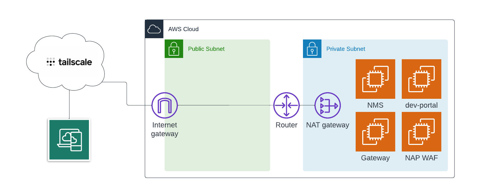

# NGINX Management Suite Lab

This repository will build out a 4 server deployment in AWS allowing the user to test the NGINX Management Suite, API Connectivity Manager, Developer Portal, and API Gateway instances. Additionally, the NMS Security Monitor module is installed on the NMS instance. Finally, an instance with NGINX App Protect WAF is provided, and its agent is configured to send security metrics and events to NMS.

> Note: This deployment leverages [Tailscale](https://tailscale.com/) to connect into the EC2 instances.



## Deployment

> Note: You will need to save your *nginx-repo.crt* and *nginx-repo.key* in the base folder of this project. Also, you will need to base64 encode your NMS license file and save it to *nms-license-b64.txt* in the base folder of this project.

Create a `terraform.tfvars` file in the base folder of this project with this content updated as appropriate:

```
region = "<your aws region name>"
owner_name = "<your owner name>"
owner_email = "<your owner email address>"
key_name = "<your existing AWS ssh key name>"
tailscale_auth_key = "<your tailscale auth key>"
nms_admin_password = "<your password for the NMS admin account>"
```

Run the following Terraform commands to deploy the environment:

```bash
terraform init
terraform apply --auto-approve
```

Once deployment is complete, you can browse to `https://<nms server tailscale public ip>`.
